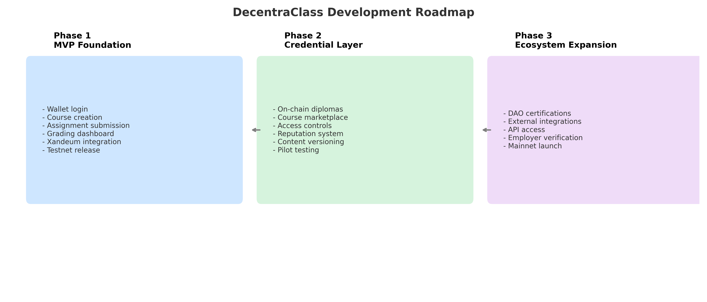

# DecentraClass Roadmap

The following roadmap outlines the phased development plan for DecentraClass, a decentralized education platform built on the Xandeum storage layer. Each phase introduces key features that support the core mission: to give students and educators ownership over academic content and credentials.

## Phase 1: MVP Foundation
- User onboarding via wallet authentication
- Course creation and editing
- Assignment submission interface
- Grading and feedback dashboard
- Read/write integration with Xandeum storage
- Testnet deployment with limited user testing

## Phase 2: Credential Layer
- Minting on-chain diplomas and badges as NFTs or verifiable credentials
- Launch of a decentralized course marketplace
- Access control for public/private course materials
- Basic reputation system for students and educators
- Content versioning and edit history
- Expanded testing with pilot institutions

## Phase 3: Decentralized Education Ecosystem
- DAO-managed certification and moderation tools
- Protocol documentation for external integrations
- Third-party API access to student record data
- Interoperability with DAO tools, coding bootcamps, and employer verifications
- Full mainnet launch with staking-based incentives

---

## Visual Timeline

